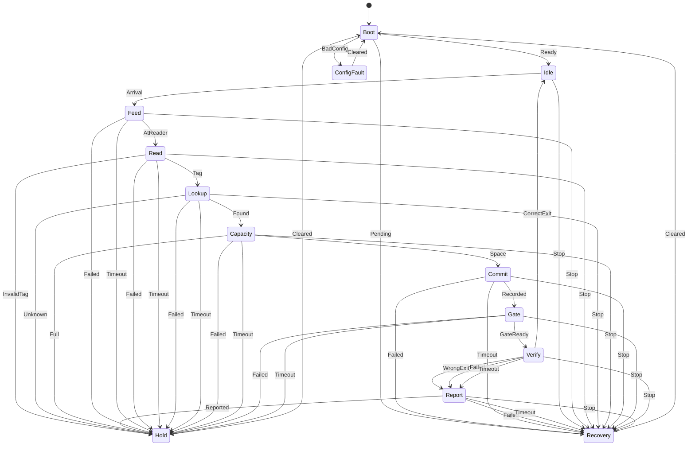

# Automate de référence

Les transitions sont les mêmes que dans le moteur C++. Un événement absent est refusé. Cleared est réservé à la réconciliation physique et comptable.

```mermaid
stateDiagram-v2
 [*] --> Boot
 Boot --> Idle : Ready
 Boot --> ConfigFault : BadConfig
 Boot --> Recovery : Pending
 ConfigFault --> Boot : Cleared
 Recovery --> Boot : Cleared
 Hold --> Boot : Cleared
 Idle --> Feed : Arrival
 Feed --> Read : AtReader
 Read --> Lookup : Tag
 Read --> Hold : InvalidTag
 Lookup --> Capacity : Found
 Lookup --> Hold : Unknown
 Capacity --> Commit : Space
 Capacity --> Hold : Full
 Commit --> Gate : Recorded
 Gate --> Verify : GateReady
 Verify --> Idle : CorrectExit
 Verify --> Report : WrongExit
 Report --> Hold : Reported
 Feed --> Hold : Failed
 Feed --> Hold : Timeout
 Read --> Hold : Failed
 Read --> Hold : Timeout
 Lookup --> Hold : Failed
 Lookup --> Hold : Timeout
 Capacity --> Hold : Failed
 Capacity --> Hold : Timeout
 Commit --> Recovery : Failed
 Commit --> Recovery : Timeout
 Gate --> Hold : Failed
 Gate --> Hold : Timeout
 Verify --> Report : Failed
 Verify --> Report : Timeout
 Report --> Recovery : Failed
 Report --> Recovery : Timeout
 Idle --> Recovery : Stop
 Feed --> Recovery : Stop
 Read --> Recovery : Stop
 Lookup --> Recovery : Stop
 Capacity --> Recovery : Stop
 Commit --> Recovery : Stop
 Gate --> Recovery : Stop
 Verify --> Recovery : Stop
 Report --> Recovery : Stop
```
